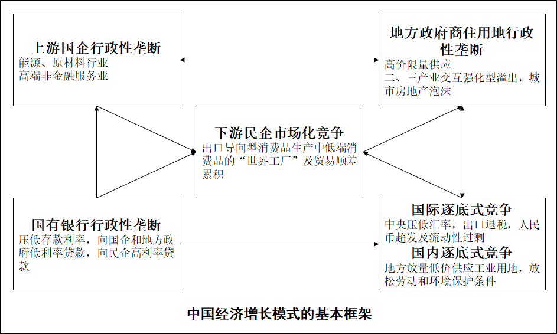

# 关于本书

书名：《人地之间：中国增长模式下的城乡土地改革》

作者：陶然

出版社：辽宁人民出版社

出版时间：2022-12

ISBN：978-7-205-10557-0

# 读书笔记

## 绪论 中国城乡土地制度的整体挑战

从中国城市化的两个主要维度，即“人口城市化”和“土地城市化”来看，一系列矛盾很突出，特别是以“完全市民化”为指标的“人口城市化”远远慢于以城市建成区空间扩张为主要表现形式的“土地城市化”，结果出现了“土地过度城市化”和“人口不完全城市化”并存的不协调局面。这些矛盾的出现和激化主要是因为现有城乡土地制度以及相关的户籍、规划、地方财政体制并没有被全面理顺，进而给地方政府带来了方向上有偏的激励。

本书的分析表明，大量农村外出打工人口及其家庭成员之所以无法在城市实现举家永久性迁移，是因为没有推动城乡结合部的集体土地制度改革及配套户籍改革，无法建立一个良性的机制让迁移人口从农村逐渐但又彻底地转移出来；农村人口的不完全迁移导致“离乡不离土”成为我国城市化中的普遍现象，并带来了传统农区农地破碎化及新批宅基地不断占用耕地的现象，增加了传统农区农地和宅基地以更完整权利为基础实现市场化流转和抵押的难度。

要实现“农村人口逐步永久性外迁——农地与农村建设用地有效整理——农地产权稳定、宅基地占地不再扩大——农地与宅基地有效流转——农业经营规模扩大、村庄建设用地集约利用”的良性循环，就必须在推动城市户籍改革的同时，切实推动城乡土地制度的系统性改革。

## 第一章 中国增长模式与“土地财政”的兴起

本章主要考察了我国从20世纪末逐步发展起来的经济增长模式，以及同一时期地方政府以“土地财政”“土地金融”为依托推动的工业化和城市化。

中国当前的增长模式可以总结为：集权的经济管理体制下，民营企业在下游制造业行业进行“一类市场化竞争”；中央和地方政府在国际、国内展开“两层逐底式竞争”；国企在上游部门，国有银行在金融行业，地方政府在商住用地出让上实施“三领域行政性垄断”。

其中，中央和地方政府展开的“国际和国内两层式逐底式竞争”非常有力地支持了“一类市场化竞争”下民营企业的快速成长和出口，并最终为中央、地方政府取得税收收入，为上游国企、国有银行和地方政府通过“三领域行政性垄断”抽取高额租金创造了条件。

## 第二章 “土地财政”下的策略性出让及多重扭曲

本章考察了在“土地财政”下，地方政府对不同用途土地的策略性差别出让及其引发的多重扭曲。

在工业用地上，由于制造业招商引资竞争而形成一个“全国性买方市场”，但在商住用地上却出现了每个城市的“局域性卖方市场”，地方政府很容易将高地价转嫁给本地服务业、住宅业的消费者。

不同产业（制造业和服务业）的流动性差异，不同产业的纳税类型及其可持续性的差异，共同引发了地方政府对不同产业用地的策略性差别出让，最终体现为商住用地和工业用地之间不断扩大的价格差异。

## 第三章 征地改革和集体经营性建设用地入市

本章分析了既有财政和土地管理体制塑造的利益格局，并考察征地体制改革与集体经营性建设用地入市之间的关系。

地方政府形成了“强制征地、贷款建设工业区——招商引资带来制造业成长——贷款建设新城区并出让商住用地获得出让金——政府偿还债务”的发展方式，在“土地财政”和“土地金融”中越陷越深，征地体制改革进展缓慢，集体经营性建设用地入市也面临诸多利益冲突和现实困难。

## 第四章 “涨价归公”、公平补偿和征地合法性

本章从“涨价归公”理念出发，分析如何通过提高征地补偿标准，尤其是推动多元化征地补偿，增强政府征地行为的合法性。

土地征收引发较大矛盾的关键原因是政府制定和实施的过低补偿标准，为缓解矛盾，过去20多年来中央政府不断调整征地补偿标准，保障失地农民“原有生活不降低，长远生计有保障”，2020年新《土地管理法》出台，但能够真正发挥作用还有待进一步观察。

本书认为，逐步从“留用地安置”走向“留用物业安置”，是我国发达地区未来城乡结合部征地改革的主要方向。

## 第五章 传统农区土地改革的局限和进路

本章分析了我国传统农区的土地“三权分置”改革，考察传统农区土地改革的已有进展、局限及未来出路。

目前集体土地所有制下，村民对土地财产的转让、交易、抵押权利不完整，导致农村地区许多农业和非农用地配置效率和投资效率非常低下，严重制约了农地的规模经营、农业现代化以及国家耕地保护目标的实现。

本书建议对传统农区的农地、宅基地及集体经营性建设用地，可以逐步推动自愿基础上的国有化，同时赋予使用者对农村土地的永久使用权，实现土地权利人更充分的交易和抵押权。

## 第六章 耕地保护和土地指标交易

本章主要关注如何完善现有的耕地保护制度，尤其是进一步推动土地指标跨区配置和市场交易的问题。

我国现有耕地保护制度的三个核心内容，分别是“农地转用的计划管理和分级审批制度”、“耕地占补平衡制度”和“基本农田保护制度”，在实践中，这些制度面临着多方面的挑战，难以达到政策制定者希望达到的效果。

本书建议通过建立三类土地发展权转移和跨区交易市场来增加耕地保护制度的弹性，并为农村土地整理提供制度平台和融资来源（土地发展权，其可以进行相应的空间转移和跨区市场化交易，即将一块土地进行非农开发的权利通过市场机制转移到另一块土地上）。

## 第七章 产业升级与城市存量低效用地再开发

本章考察了产业升级背景下的工业用地再开发，以及城市低效存量土地的集约节约利用。

通过对城市存量低效用地的结构调整，特别是将一定比例的低效用转化为高价值的住宅用地，实现城市存量土地的再开发。

## 第八章 城市更新的困局和模式创新

本章探讨了以城中村和城市老旧小区为主要对象的城市更新，提出通过创新模式来突破既有更新困局。

本书提出了“两个竞争加一个腾挪”的思路，第一，设计有效的推动各个潜在更新片区之间作为土地供应方的竞争机制；第二，设计有效的激发不同开发商之间作为潜在土地需求方的竞争机制；第三，为充分发挥前两类竞争机制的作用，还要适度加大规划的灵活度，合理调整更新片区范围，利用更新片区附近的农地、产业用地乃至片区内部相对连片且容易拆迁的地段制造出一个有效的“腾挪空间”。
